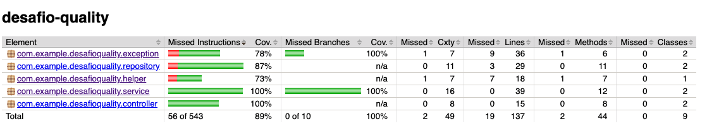

# Desafio Quality

## Tests Coverage



<br>

## Entidades da aplicação

-  Property
```java
public class Property {
    private Long id;
    
    private String name;
    
    private District district;
    
    private List<Room> rooms;
    
    public Double getArea() {}
}
```

-  District
```java
public class District {
    private String name;
    
    private BigDecimal squareMeterPrice;
}
```

-  Room
```java
public class Room {
    private Long id;
    
    private String name;
    
    private Double width;

    private Double length;
    
    public Double getArea() {}
}
```

## Padronização de nomes dos métodos (Controller, Service e Respository)
` public void findAll() - Busca todos os objetos `

` public void findByAttribute() - Buscar por um atributo específico `

` public void save() - Cadastrar uma informação `

## Payloads de imóvel

Cadastra um novo imóvel

` POST /api/v1/property `
```json
{
    "name": "",
    "district": {
        "name": "",
        "squareMeterPrice" : 0
    },
    "rooms": [
        {
            "name": "",
            "width": 0,
            "length": 0
        },
        {
            "name": "",
            "width": 0,
            "length": 0
        }
    ]
}
```

<br>

Calcula o total de metros quadrados de uma propriedade

` GET /api/v1/property/area  `

<br>

Calcula o valor de uma propriedade com base em seus cômodos e
medidas.

` GET /api/v1/property/price  `

<br>

Determina qual é o maior cômodo.

` GET /api/v1/property/room/biggest `

<br>

Determina a quantidade de metros quadrados que tem cada
cômodo de uma propriedade.

` GET /api/v1/property/room/area  `
